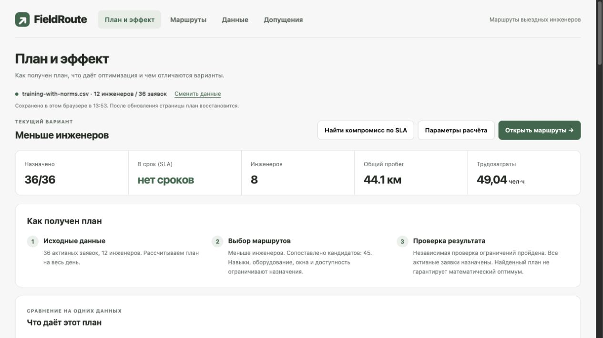

# FieldRoute

**Помощник диспетчера выездных инженеров для кейса «Билайн Бизнес».**
Распределяет заявки с учётом квалификаций, оборудования, транспорта, клиентских
окон и смен. При аварии или задержке инженера пересчитывает оставшуюся часть дня
и показывает, у каких заявок изменились исполнитель и время.

Диспетчер видит цену решения: сколько работ назначено, сколько инженеров
задействовано, как меняются пробег, сроки и трудозатраты. Он может сравнить
варианты, проверить ручное назначение и сохранить выбранный план.

## Результаты на воспроизводимых примерах

| Сценарий | Простой FIFO | FieldRoute | Результат |
| --- | --- | --- | --- |
| Учебный день: 12 инженеров, 36 заявок | 36/36 назначений, 8 инженеров, 83,88 км | 36/36 назначений, 8 инженеров, 44,13 км | **−47,4% расчётного пробега** при том же покрытии и числе инженеров |
| Перегрузка: 15 инженеров, 100 заявок | 39/100 назначений, 15 инженеров, 80,43 км | 62/100 назначений, 15 инженеров, 80,42 км | **На 23 назначения больше** при том же числе инженеров |

Это синтетические входы из репозитория: Haversine с коэффициентом дороги 1,25,
полный поиск `full`, цель `staff_first`, приоритет классов `organizer`.
Оба алгоритма получают одинаковые данные и модель расстояний; все шесть планов
трёх контрольных примеров прошли проверку ограничений при повторном прогоне
29.09.2026. Проценты описывают эти сценарии, а не гарантированную экономию при
внедрении. Улучшение покрытия или пробега может сопровождаться ухудшением сроков
и нагрузки отдельных инженеров.

[Алгоритм, исходные данные и повторение сравнения](ALGORITHM.md) ·
[Протокол проверки показателей](docs/verification/comparison-2026-09-29.json)



*Экран текущего приложения: «Пример с нормативами», Haversine. В этом наборе
нет SLA-дедлайнов; «нет сроков» не означает достигнутые 100% SLA.*

## Что можно проверить

| Задача диспетчера | Реализация | Где посмотреть |
| --- | --- | --- |
| Распределить работы с учётом ограничений | Навыки, оборудование, транспорт, окна, смены и доступность; независимая проверка готового плана | «Данные → Проверить ограничения»; [валидатор](app/services/validation.py) |
| Выбрать баланс ресурсов и сроков | Цели «Меньше инженеров», «Меньше километров», «Соблюдать SLA»; сравнение с FIFO | «План и эффект → Эффект оптимизации» и «Цена соблюдения сроков» |
| Обслужить приоритетную работу при нехватке ресурсов | Порядок классов «Авария → Подключение → Ремонт / Дозаказ»; поиск цепочки освобождения специалиста | [Контрольный пример приоритетов](examples/priority/specialist-chain.request.json) и [его результат](ALGORITHM.md#сравнение-с-fifo) |
| Перестроить смену после события | Срочная или обычная новая заявка, отмена, задержка, недоступность; сохранение выполняемых работ и явных закреплений по правилам пересчёта | «+ Добавить событие», затем «Изменения после события» |
| Оставить решение за диспетчером | Предварительная проверка ручного назначения, причины отказа, применение допустимого варианта | Раскрыть заявку в расписании → «Проверить назначение» |
| Разделить работу районов | В режиме `strict` каждый район рассчитывается со своими инженерами | «Данные → Проверить два района» |
| Продолжить работу с планом | Автосохранение в браузере, журнал событий, экспорт и восстановление JSON | «Данные → Сохранённый план» |

Порядок приоритетов определяет компромиссы: более важная заявка может вытеснить
несколько менее важных. Независимый валидатор проверяет допустимость результата;
поиск остаётся ограниченной эвристикой без гарантии глобального оптимума.

## Сценарий знакомства

После запуска приложения:

1. **Данные → Пример с нормативами → Построить план.** Оцените назначения,
   инженеров и пробег. В «Эффекте оптимизации» сравните FIFO с целью
   «Меньше инженеров» на тех же данных.
2. **Открыть маршруты →.** Выберите инженера, раскройте заявку и посмотрите
   расписание. Проверьте последствия ручного назначения до его применения.
3. **+ Добавить событие.** Добавьте срочную заявку и пересчитайте план.
   Сравните исполнителей и время до/после, затем сохраните результат.

[Пошаговый сценарий для жюри, ожидаемые результаты и дополнительные проверки](JURY_GUIDE.md).

## Быстрый запуск

Нужны Python 3.11+ и доступ к PyPI для установки зависимостей.
Команды выполняются из корня репозитория.

```bash
python3 -m venv .venv
source .venv/bin/activate
python -m pip install -c constraints.txt -e .
python -m uvicorn app.main:app --host 127.0.0.1 --port 8000
```

На Windows активация в PowerShell: `.venv\Scripts\Activate.ps1`.

Приложение: [http://127.0.0.1:8000](http://127.0.0.1:8000).
API: [http://127.0.0.1:8000/docs](http://127.0.0.1:8000/docs).
При первом открытии загружается встроенный сценарий; при следующих открытиях
может восстановиться сохранённый план. Для описанного сравнения явно выберите
«Пример с нормативами».

По умолчанию быстрый запуск использует приближённые расстояния Haversine и
не требует дорожных данных. `.env` и переменные окружения могут изменить режим;
проверьте `routing_backend` через `/api/v1/health` перед повторением измерений.

Тот же режим в Docker:

```bash
docker compose up --build
```

### Проверка через API

```bash
curl http://127.0.0.1:8000/api/v1/health
curl -X POST -H 'Content-Type: application/json' --data-binary @examples/priority/specialist-chain.request.json http://127.0.0.1:8000/api/v1/plan
```

В ответе `routes` содержит маршруты, `unassigned` — неназначенные работы,
`metrics` — показатели, `diagnostics` — этапы поиска. Пример показывает
освобождение специалиста для заявки более высокого класса.
Файлы `*.request.json` передаются в API; кнопка «Открыть план из JSON»
принимает сохранённое состояние приложения с запросом и готовым планом.

## Дорожные маршруты и поиск адресов

Нужны Docker с Compose 2.20+, интернет при первом запуске и около 3 ГБ
свободного места для выгрузки Москвы и подготовленных графов.
Остановите быстрый режим, если он занимает порт 8000.

```bash
docker compose -f compose.roads.yaml up --build
```

Данные сохраняются в `.local/roads/`; следующие запуски используют их повторно.
В этом режиме расчёт использует локальные автомобильный, пеший и велосипедный
графы OSRM, а поиск адресов — локальный индекс. Источник дорожных данных:
© OpenStreetMap contributors, [ODbL](https://www.openstreetmap.org/copyright).
Показатели таблицы выше относятся к Haversine; на дорожной модели нужен
отдельный расчёт.

## Данные и границы применимости

- В комплекте есть учебные CSV, профили и три контрольных JSON-запроса.
  Опубликованные сравнения выполнены на синтетических входах; они не подтверждают
  результат на адресах организатора или в промышленной эксплуатации.
- Для своих CSV нужно подготовить координаты, профили инженеров и правила работ.
  Интерфейс проверяет входные строки и позволяет уточнять координаты.
- В режимах Haversine и `local_roads` время дороги вычисляется из расстояния
  и заданной скорости. Пробки и расписания общественного транспорта не моделируются;
  в `local_roads` общественный транспорт приближённо оценивается по автомобильной сети.
- Клиентское окно — обязательное ограничение с выбранной семантикой начала
  или завершения визита. SLA — отдельный мягкий срок; наличие допустимого плана
  не означает соблюдения всех SLA.
- Автосохранение относится к этому браузеру и адресу приложения. Для переноса
  и резервной копии используйте «Скачать показанный план».

## Развёртывание с HTTPS и паролем

Ubuntu 24.04 и 26.04, из корня checkout на сервере:

```bash
sudo bash deploy-ubuntu.sh routes.example.org --external-routing
```

Замените `routes.example.org` своим доменом. Внешний режим не загружает OSM
и не строит графы на VPS. Для локального режима используйте `--local-routing`.
Выбранный режим и пароль сохраняются. Перед запуском домен должен указывать
на сервер, TCP 80/443 должны быть открыты.
[Подробности, ограничения публичных сервисов и управление](DEPLOYMENT.md).
